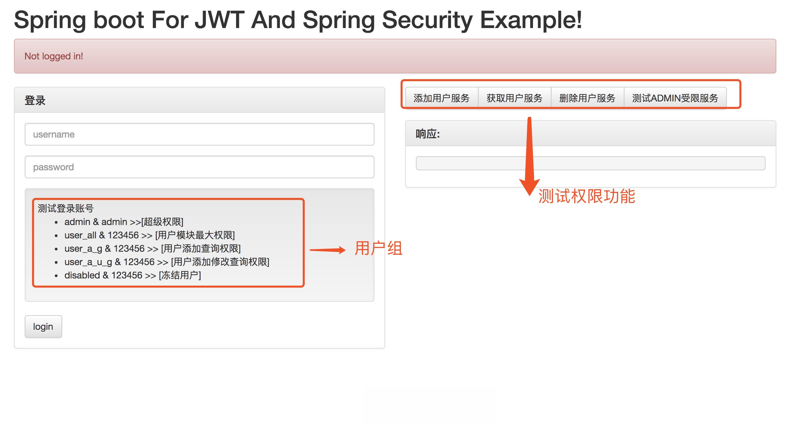
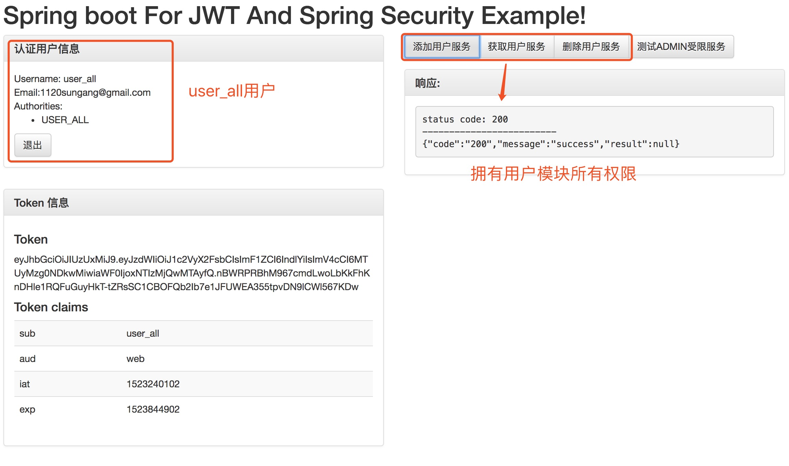
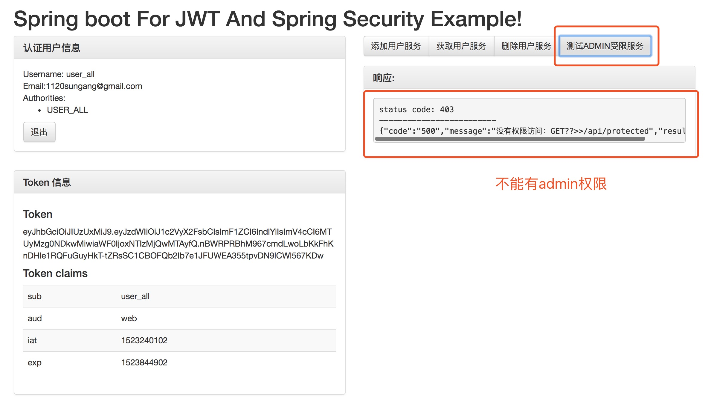
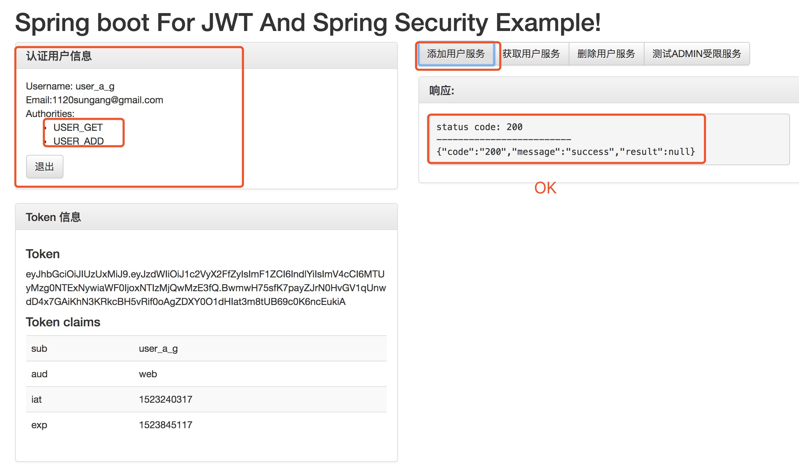
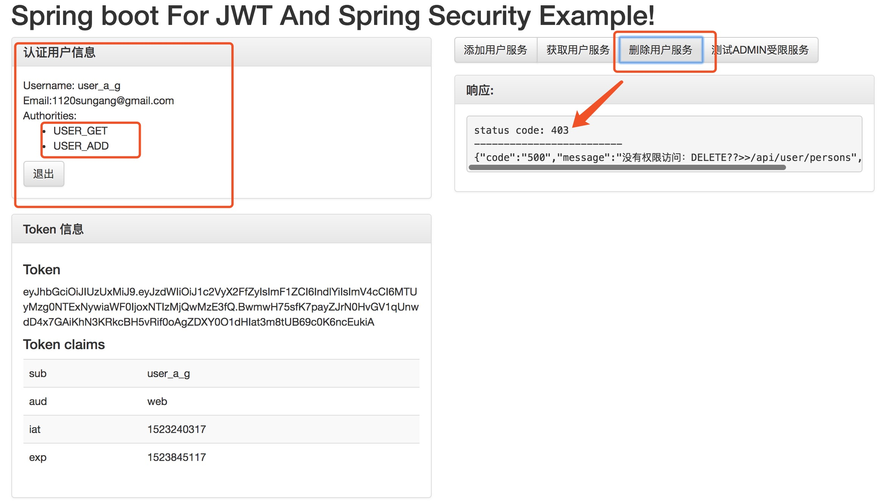

# spring-boot-security-with-jwt


实现spring boot + security + jwt实现 纯restful 接口权限控制


通用技术选型：

    springboot脚手架，集成mybatis security为一体,使用mybatis 通用分页pagehelper. 通用Mapper.

描述: 

    集成统一异常处理，支持i18n国际化，支持通配符 具体异常处理可以参考
    
访问:[spring-boot-exception-handler](https://github.com/aillamsun/spring-boot-exception-handler)


#开发工具
项目使用了lombok 用idea开发的小伙伴请安装lombok插件，不然会提示报错


#运行方式

## car_admin

### 导入sql脚本

```mysql
/*
 Navicat Premium Data Transfer

 Source Server         : localhost
 Source Server Type    : MySQL
 Source Server Version : 50717
 Source Host           : localhost
 Source Database       : skcar

 Target Server Type    : MySQL
 Target Server Version : 50717
 File Encoding         : utf-8

 Date: 04/09/2018 10:22:18 AM
*/

SET NAMES utf8mb4;
SET FOREIGN_KEY_CHECKS = 0;

-- ----------------------------
--  Table structure for `sys_permission`
-- ----------------------------
DROP TABLE IF EXISTS `sys_permission`;
CREATE TABLE `sys_permission` (
  `id` bigint(20) NOT NULL,
  `name` varchar(255) DEFAULT NULL,
  `pid` bigint(20) DEFAULT NULL,
  `method` varchar(50) DEFAULT NULL COMMENT '请求方法',
  `permission_url` varchar(255) DEFAULT NULL COMMENT '授权链接',
  `description` varchar(255) DEFAULT NULL,
  `create_time` datetime DEFAULT NULL,
  PRIMARY KEY (`id`)
) ENGINE=InnoDB DEFAULT CHARSET=utf8 ROW_FORMAT=COMPACT COMMENT='系统权限表';

-- ----------------------------
--  Records of `sys_permission`
-- ----------------------------
BEGIN;
INSERT INTO `sys_permission` VALUES ('1', 'ADMIN', null, 'ALL', '/api/**', '项目最大权限', '2017-10-24 15:49:04'), ('2', 'USER_ALL', null, 'ALL', '/api/user/**', '用户所有权限', '2017-10-24 15:49:01'), ('3', 'USER_GET', null, 'GET', '/api/user/**', '获取单个用户', '2017-10-24 14:44:24'), ('4', 'USER_PUT', null, 'PUT', '/api/user/**', '修改用户', '2017-10-24 14:45:22'), ('5', 'USER_ADD', null, 'POST', '/api/user/**', '添加用户', '2017-10-24 14:46:03'), ('6', 'USER_ DELETE', null, 'DELETE', '/api/user/**', '删除用户', '2017-10-24 15:49:46');
COMMIT;

-- ----------------------------
--  Table structure for `sys_role`
-- ----------------------------
DROP TABLE IF EXISTS `sys_role`;
CREATE TABLE `sys_role` (
  `id` bigint(20) NOT NULL AUTO_INCREMENT,
  `name` varchar(45) NOT NULL COMMENT '角色名称',
  `role` varchar(45) DEFAULT NULL,
  `description` varchar(45) DEFAULT NULL,
  `is_all` int(11) DEFAULT '0' COMMENT '是否是全选 0 否 1 是',
  `create_time` datetime DEFAULT NULL,
  `create_user_id` bigint(20) DEFAULT NULL COMMENT '创建人id',
  `status` int(45) DEFAULT NULL COMMENT '0 不可用 1 可用',
  PRIMARY KEY (`id`)
) ENGINE=InnoDB AUTO_INCREMENT=21 DEFAULT CHARSET=utf8 ROW_FORMAT=COMPACT COMMENT='角色表';

-- ----------------------------
--  Records of `sys_role`
-- ----------------------------
BEGIN;
INSERT INTO `sys_role` VALUES ('1', 'Admin', 'admin', 'admin', '1', '2017-10-24 11:30:03', '1', '1'), ('2', 'User_All', 'User_All', '用户所有权限', '1', '2017-10-24 11:30:19', '1', '1'), ('3', 'User_A_G', 'User_A_G', '用户添加查询权限', '1', '2017-10-24 16:27:24', '1', '1'), ('4', 'User_A_U_G', 'User_A_U_G', '用户添加修改查询权限', '1', '2017-10-24 17:20:05', '1', '1');
COMMIT;

-- ----------------------------
--  Table structure for `sys_role_permission`
-- ----------------------------
DROP TABLE IF EXISTS `sys_role_permission`;
CREATE TABLE `sys_role_permission` (
  `id` bigint(20) NOT NULL,
  `role_id` bigint(20) NOT NULL,
  `permission_id` bigint(20) NOT NULL,
  PRIMARY KEY (`id`)
) ENGINE=InnoDB DEFAULT CHARSET=utf8 ROW_FORMAT=COMPACT;

-- ----------------------------
--  Records of `sys_role_permission`
-- ----------------------------
BEGIN;
INSERT INTO `sys_role_permission` VALUES ('1', '1', '1'), ('2', '2', '2'), ('3', '3', '3'), ('4', '4', '4'), ('5', '4', '5'), ('6', '3', '5'), ('7', '4', '3');
COMMIT;

-- ----------------------------
--  Table structure for `sys_user`
-- ----------------------------
DROP TABLE IF EXISTS `sys_user`;
CREATE TABLE `sys_user` (
  `id` bigint(20) NOT NULL AUTO_INCREMENT,
  `username` varchar(255) NOT NULL COMMENT '用户名',
  `password` varchar(255) NOT NULL COMMENT '用户密码',
  `name` varchar(255) DEFAULT NULL COMMENT '用户姓名',
  `sex` int(2) DEFAULT NULL COMMENT '性别 1 男 2 女',
  `email` varchar(255) DEFAULT NULL COMMENT '邮箱',
  `title` varchar(255) DEFAULT NULL COMMENT '职称',
  `phone` varchar(11) NOT NULL COMMENT '电话',
  `organ_id` bigint(20) NOT NULL COMMENT '公司id',
  `dept_id` bigint(20) NOT NULL COMMENT '部门id',
  `position` varchar(30) DEFAULT NULL COMMENT '职位',
  `job` varchar(30) DEFAULT NULL COMMENT '岗位',
  `create_time` datetime DEFAULT NULL COMMENT '创建时间',
  `create_user_id` bigint(20) DEFAULT NULL COMMENT '创建人',
  `status` int(4) DEFAULT '1' COMMENT '1 正常 2 锁定 3 删除',
  `remark` varchar(255) DEFAULT NULL COMMENT '备注',
  `last_password_reset_date` datetime DEFAULT NULL,
  PRIMARY KEY (`id`)
) ENGINE=InnoDB AUTO_INCREMENT=7 DEFAULT CHARSET=utf8 ROW_FORMAT=COMPACT;

-- ----------------------------
--  Records of `sys_user`
-- ----------------------------
BEGIN;
INSERT INTO `sys_user` VALUES ('1', 'admin', '$2a$08$lDnHPz7eUkSi6ao14Twuau08mzhWrL4kyZGGU5xfiGALO/Vxd5DOi', null, null, null, null, '13076061657', '1', '1', null, null, '2017-10-24 11:31:12', '1', '1', null, '2017-10-24 12:59:14'), ('2', 'user_all', 'fEqNCco3Yq9h5ZUglD3CZJT4lBs=', null, null, null, null, '307071768', '1', '1', null, null, '2017-10-24 11:32:12', '1', '1', null, '2017-10-24 12:59:17'), ('3', 'disabled', 'fEqNCco3Yq9h5ZUglD3CZJT4lBs=', null, null, null, null, '111', '1', '1', null, null, '2017-10-24 11:32:46', '1', '0', null, '2017-10-24 12:59:21'), ('5', 'user_a_g', 'fEqNCco3Yq9h5ZUglD3CZJT4lBs=', null, null, null, null, '1', '1', '1', null, null, '2017-10-24 16:24:58', null, '1', null, null), ('6', 'user_a_u_g', 'fEqNCco3Yq9h5ZUglD3CZJT4lBs=', null, null, null, null, '1', '1', '1', null, null, '2017-10-24 16:25:27', null, '1', null, null);
COMMIT;

-- ----------------------------
--  Table structure for `sys_user_role`
-- ----------------------------
DROP TABLE IF EXISTS `sys_user_role`;
CREATE TABLE `sys_user_role` (
  `id` bigint(20) NOT NULL,
  `user_id` bigint(20) NOT NULL,
  `role_id` bigint(20) NOT NULL,
  PRIMARY KEY (`id`)
) ENGINE=InnoDB DEFAULT CHARSET=utf8 ROW_FORMAT=COMPACT COMMENT='用户角色表';

-- ----------------------------
--  Records of `sys_user_role`
-- ----------------------------
BEGIN;
INSERT INTO `sys_user_role` VALUES ('1', '1', '1'), ('2', '2', '2'), ('3', '3', '2'), ('4', '5', '3'), ('5', '6', '4');
COMMIT;

SET FOREIGN_KEY_CHECKS = 1;

```

访问:[http://localhost:8021](http://localhost:8021)


### 效果图1



### 效果图2 测试用户模块 user_all & 123456 >> [用户模块最大权限]




### 效果图3 测试用户模块 user_a_g & 123456 >> [用户添加查询权限]



